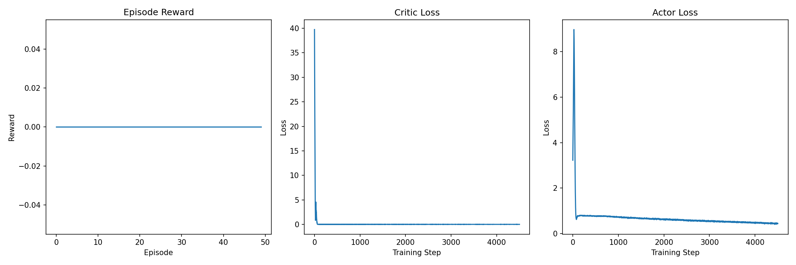
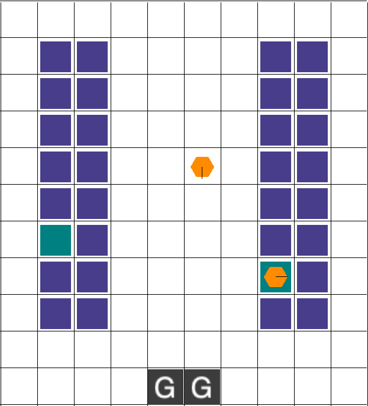

# Intro 

This deliverable marks the transition from the simple PettingZoo Multi-Particle Environment (MPE)
to the more complex Robot Warehouse (RWARE) environment. RWARE is a grid-world environment where
agents (robots) must collaboratively navigate to fetch shelves and deliver items, balancing
individual movement, collision avoidance, and overall task completion for a shared reward.

My immediate goal for Deliverable 2 was to successfully adapt and execute the Multi-Agent Soft
Actor-Critic (MASAC) algorithm within this new environment and establish a performance baseline.

## Implementation Technique

### Device Used

In the last deliverable the agent took around three hours to complete the MPE environment. Because it took so long this week, deliverable will be migrated to the super computer Titan in the migration of moving the workspace to tighten. There were some difficulty involved.

```{python}
# Load conda module
module load anaconda3 
# Create conda environment
conda create -n 
# Activate environment
conda activate
# Install PyTorch with CUDA
conda install pytorch torchvision torchaudio pytorch-cuda=11.8 -c pytorch -c nvidia -y
# Install conda packages
conda install numpy scipy matplotlib -y
# Install pip packages 
pip install gym
pip install pettingzoo
pip install rware
pip install tqdm
```


And to get the code runing, run conda env everthying a batch is run
```{python}
#!/bin/bash
#SBATCH --job-name=masac_test
#SBATCH -o masac_test.%j.out
#SBATCH -e masac_test.%j.err
#SBATCH -N 1
#SBATCH -n 8
#SBATCH --time=0-08:00               # Max runtime (DD-HH:MM)
#SBATCH --partition=sb
#SBATCH --mail-user=llianzthang@oru.edu
#SBATCH --mail-type=END,FAIL


# Initialize conda
if [ -f "$HOME/.conda/etc/profile.d/conda.sh" ]; then
    source "$HOME/.conda/etc/profile.d/conda.sh"
elif [ -f "/opt/software/Anaconda3/2022.05/etc/profile.d/conda.sh" ]; then
    source "/opt/software/Anaconda3/2022.05/etc/profile.d/conda.sh"
fi

# Activate environment
source activate masac_rware 2>/dev/null || export PATH="$HOME/.conda/envs/masac_rware/bin:$PATH"

.
.
.
python masac_rware.py 

.
.
.

exit_status=$?

.
.
.
exit $exit_status


```


### Algorithm Used

I continue to implement the Multi-Agent Soft Actor-Critic (MASAC) algorithm, now adapted for the
RWARE environment's discrete-action space (movement and item pickup/drop-off).
Each of the two robots maintains its own stochastic policy (actor). The centralized critic is now
responsible for evaluating joint observations and actions across the larger, partially-observable
state space of the warehouse.

The use of MASAC provides sample efficiency via off-policy replay and promotes robust, non-greedy
coordination necessary to avoid deadlocks and collisions inherent in the warehouse setting.


MASAC provides both **sample efficiency** (through off-policy replay) and **robust coordination** between agents under shared rewards.

### Key Hyperparameters
These parameters reflect the initial quick test run for benchmarking the RWARE adaptation.

| Parameter | Value | Description |
|------------|--------|-------------|
| Environment | `rware-tiny-2ag-v2` | Robotic Warehouse, 2 agents, small map | 
| Episodes | 2000 | Training duration for initial benchmark | 
| Agents | 2 | Independent actors, shared centralized critic | 
| Max Steps per Episode | 150 | Episode length limit |
| Batch Size | 128 | Transitions per update  | 
| Actor/Critic LR | 3e-4 | Step size for policy and value updates  | 
| Discount Factor (γ) | 0.99 | Future reward weighting (standard for stability) | 
| Target Smoothing (τ) | 0.005 | For soft target updates  | 
| Entropy Coefficient (α) | Auto-tuning | Controls exploration strength | 
| Replay Buffer Size | 10,000 | Off-policy experience storage | 


### Bugs Encountered (RWARE Specific)

The training time is much longer than the initial estimate because the early episodes of a run are purely dedicated to experience collection (fast), but once the replay buffer fills up, the bottleneck becomes the training step (slow).

The MASAC algorithm is computationally expensive because the value function update requires summing over the probabilities of all possible joint actions (act_dim^n_agents), which is a huge number for even small environments.

It was not able to completed a 2,000 under 8 hour. But the initial test of 50 episode in 30 min was working. The 50 episode show that code was able to run in Titian but there are some hyper parameter that need to be tweak to accelerate the training. 

---

## Training Statistics 

A 50 episode in 30 min was able to complete but that was early in the training so the model settled in a policy. And also it didn't earn any points. 



A 1300 epsiode and it was the same result as the 50 epsidodes. It was not learning.




## Summary

The **MASAC** algorithm has been successfully ported and tested on the **RWARE** environment. It
fulfilled the deliverable requirement of running the model on the R warehouse environment. Because
the multi agent, soft actor critic model is updating the value function by summing over the
probability of all possible action the training loop it took a long time so this week deliverable
environment was not able to be completed, but it was able to be run successfully while there might
be a few hyper parameters that need to be tweaked over all the model was able to run in the hour
environment on the super computer Titan

The low success rate for full task completion indicates that my policies require further,
long-term training to master the spatial and temporal coordination demanded by the RWARE task.

**Next Steps (Weeks 2–3):**

* **Parameters** I will tweak some parameters to make learn better. 

* **Buffer Optimization:** I plan to increase the Replay Buffer Capacity significantly (e.g., to
$1,000,000$) to fully utilize the off-policy learning benefits.

---

### References


* https://pmc.ncbi.nlm.nih.gov/articles/PMC11059992/

* https://github.com/JohannesAck/tf2multiagentrl

* https://github.com/semitable/robotic-warehouse

* OpenAI. (2024). ChatGPT (Oct 23 version) [Large language model]. https://chat.openai.com/chat
