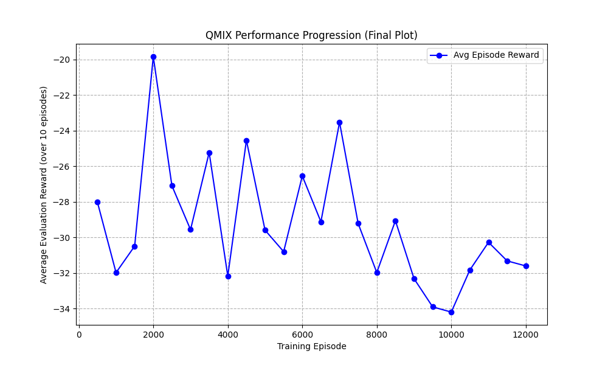
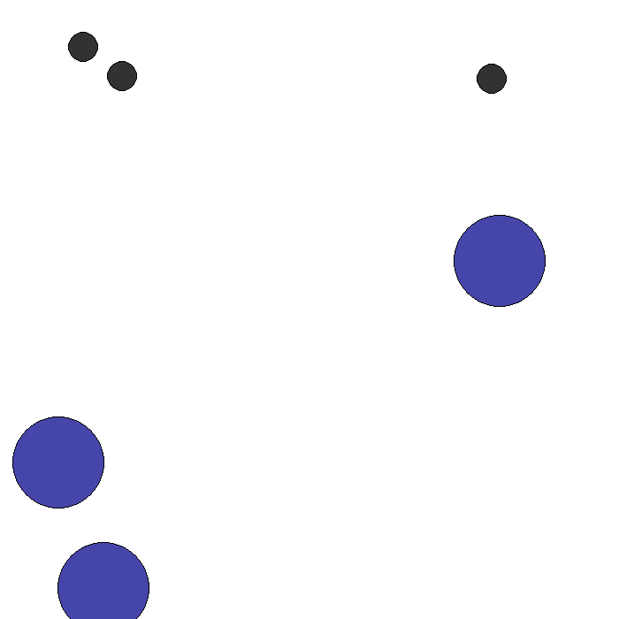
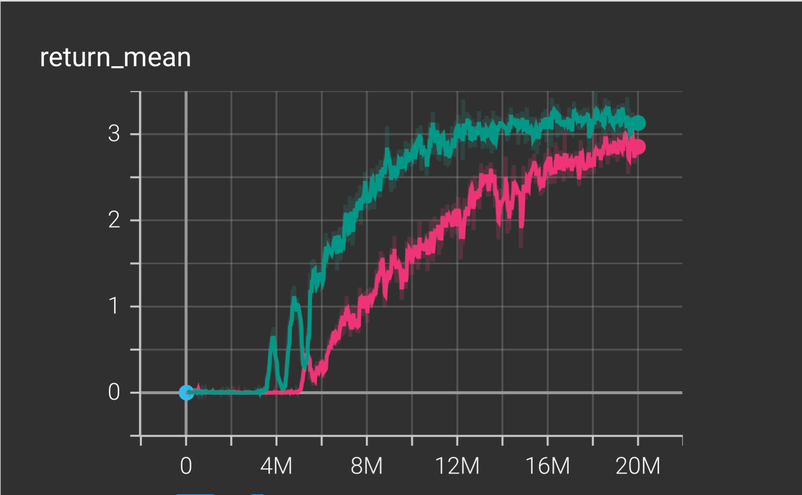
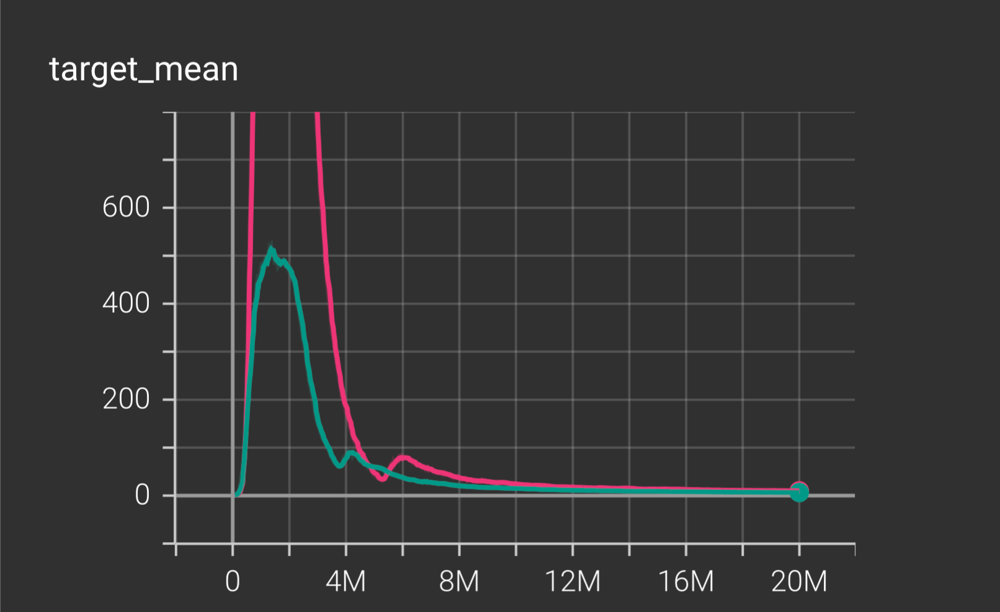
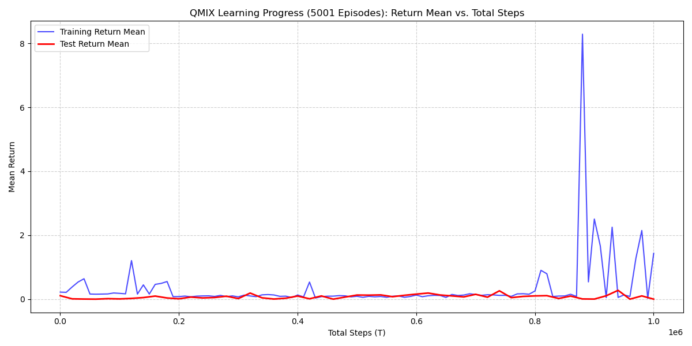

# Intro 

Create performance comparison visualizations of QMIX in (MPE → RWARE → Unity). 

# MPE

ENV 

| Parameter        | Value   | Description                                                                 |
|------------------|---------|-----------------------------------------------------------------------------|
| N (Agents)       | 3       | The number of agents in the environment.                                    |
| n_landmarks      | 3       | The number of landmarks (targets) in the environment.                       |
| max_cycles       | 25      | The maximum number of steps an episode can run before truncation.           |
| local_ratio      | 0.5     | The proportion of reward that is local vs. shared.                          |
| continuous_actions | False | Agents use discrete actions (e.g., move left/right/stop); needed for QMIX. |

Training 

| Parameter         | Value     | Description                                                                                 |
|-------------------|-----------|---------------------------------------------------------------------------------------------|
| episodes          | 2000      | Total number of planned training episodes (run ended at 200 episodes).                     |
| max_cycles        | 25        | Same as the environment’s max steps per episode.                                            |
| gamma             | 0.99      | Discount factor for future rewards.                                                         |
| lr                | 1e-3      | Learning rate for Adam optimizer.                                                           |
| buffer_capacity   | 50,000    | Maximum size of the replay buffer.                                                          |
| batch_size        | 128       | Number of transitions sampled per training step.                                            |
| start_learn_after | 1,000     | Minimum number of transitions before learning begins.                                       |
| epsilon_start     | 1.0       | Initial exploration rate (ϵ-greedy).                                                        |
| epsilon_end       | 0.02      | Minimum exploration rate after decay.                                                       |
| epsilon_decay     | 0.997     | Multiplicative decay factor per episode.                                                    |
| target_tau        | 0.005     | Polyak update rate for target network soft updates.                                         |

In the MPE QMIX is not really learning. 

# RWARE 
 
 Compare to MPE environment where we had no results, we were able to produce a result with RWARE environment. 
 
 Initial Training (Default) QMIX Hyperparameters
 
 | Parameter                | Value                  | Purpose / Why Important                                                                         |
|--------------------------|------------------------|--------------------------------------------------------------------------------------------------|
| batch_size               | 32                     | Number of samples per gradient update; affects stability and speed of learning.                 |
| buffer_size              | 5000                   | Size of replay buffer; impacts diversity of sampled experiences.                                |
| epsilon_start            | 1.0                    | Initial exploration rate; agents begin fully random.                                            |
| epsilon_finish           | 0.05                   | Minimum exploration rate; agents become mostly greedy.                                          |
| epsilon_anneal_time      | 50000                  | Duration of exploration decay; shorter means faster decay (less exploration).                   |
| t_max                    | 2,000,000              | Total environment steps; defines full training duration.                                        |
| gamma                    | 0.99                   | Discount factor for future rewards.                                                             |
| lr (learning rate)       | 0.0005                 | Controls speed of neural network updates.                                                       |
| mixer                    | qmix                   | Specifies QMIX mixing network used for joint value estimation.                                  |
| agent                    | rnn                    | Recurrent agent model enables handling partial observability.                                   |
| env_args (key)           | rware:rware-tiny-2ag-v2| Exact environment/task; required for reproducibility.                                            |
| env_args (time_limit)    | 100                    | Maximum steps per episode.                                                                      |
| save_model               | False                  | Checkpoint saving disabled (should be True for reproducibility).                                |

Modified Parameters (Attempt to Improve Reward)

| Parameter                | Value                  | Purpose / Why Important                                                                          |
|--------------------------|------------------------|---------------------------------------------------------------------------------------------------|
| batch_size               | 128                    | Larger minibatch improves stability compared to default 32.                                      |
| buffer_size              | 5000                   | Replay buffer storing past experiences; unchanged.                                                |
| epsilon_start            | 1.0                    | Initial exploration rate.                                                                         |
| epsilon_finish           | 0.05                   | Minimum exploration for exploitation phase.                                                       |
| epsilon_anneal_time      | 50000                  | Duration of epsilon decay; still relatively fast.                                                 |
| epsilon_anneal           | 2,000,000              | Additional global annealing parameter; influences exploration decay over training.                |
| t_max                    | 10,000,000             | Total training timesteps; adjusted but still shorter than improved long-run configs.              |
| gamma                    | 0.99                   | Standard RL discount factor.                                                                      |
| lr (learning rate)       | 0.001                  | Faster learning rate (higher than 0.0005).                                                        |
| mixer                    | qmix                   | Same QMIX mixing network architecture.                                                            |
| agent                    | rnn                    | Same recurrent agent architecture.                                                                |
| env_args (key)           | rware:rware-tiny-2ag-v2| Same environment/task.                                                                            |
| env_args (time_limit)    | 100                    | Same episode length limit.                                                                        |
| save_model               | False                  | Still not saving checkpoints.                                                                     |

 
 This a comparison between two model/training where 416137 is green, 959660 is pink. 
 Pink 20 millions epsiodes and green is 20 millions epsidoeds.  Green did better. 
 
 
 

x-axis is the episodes 
y-axis is the return_mean

### Return Mean
- Shows the average episodic return the agents achieve during training.  
- The teal run peaks around **3.3**, while the pink run stabilizes just under **3**.  
- Faster improvement and a higher plateau reflect stronger learning and better policy quality.  
- Overall, the teal run demonstrates more stable and higher performance.

 

x-axis is the episodes 
y-axis is the target_mean

### Target Mean
- Represents the average target Q-value the network attempts to learn.  
- A sharp spike appears early in training, followed by a gradual decline toward zero.  
- Convergence toward stable values suggests proper Q-learning without excessive overestimation.  
- The pink run exhibits larger early spikes, hinting at more instability or aggressive updates.

### Overall Interpretation
- The teal run learns faster and ultimately achieves the stronger policy.  
- Both runs show early instability that settles as training progresses.  
- Evidence suggests the teal experiment reflects a better hyperparameter choice or seed.  
- Differences between runs align with expected variability from seeds or minor configuration changes.

# Unity

| Parameter               | Value                     | Purpose / Why Important                                                                 |
|-------------------------|---------------------------|-------------------------------------------------------------------------------------------|
| batch_size              | 16                        | Number of samples per learner update; small batch → faster but noisier learning.         |
| buffer_size             | 2000                      | Replay buffer capacity storing past experiences.                                          |
| epsilon_start           | 1.0                       | Initial exploration rate (full exploration).                                              |
| epsilon_finish          | 0.1                       | Minimum exploration value when training stabilizes.                                       |
| epsilon_anneal_time     | 500000                    | Timesteps over which epsilon decays from 1.0 → 0.1.                                       |
| episode_limit           | 500                       | Maximum steps per episode.                                                                |
| env_args.no_graphics    | false                     | Runs Unity with graphics enabled.                                                         |
| env_args.time_scale     | 20.0                      | Unity simulation runs 20× faster than real time.                                          |
| t_max                   | 1000000                   | Total number of training timesteps.                                                       |
| gamma                   | 0.99                      | Standard discount factor prioritizing long-term rewards.                                  |
| lr (learning rate)      | 0.0005                    | Learning rate for optimizer controlling update speed.                                     |
| mixer                   | qmix                      | QMIX mixing network for cooperative value decomposition.                                  |
| agent                   | rnn                       | Recurrent agent network to handle partial observability.                                  |
| save_model              | true                      | Model checkpoints are saved during training.                                              |
                |

###  Metric: Mean Return
- The **Mean Return** (Y-axis) is the average cumulative reward per episode, indicating task success. A higher value is better.
- The training was allowed to run for up to **$10^6$ steps**, which is a common benchmark limit.

### Training Return Mean (Blue Line)
- **Initial Phase (0 - $8 \times 10^5$ steps):** The training return remains near **zero**, indicating a failure to find the reward signal or a sub-optimal initial policy.
- **Sharp Spike (Around $8.5 \times 10^5$ steps):** A dramatic, isolated spike occurs, reaching a high return (over 8). This suggests the agents **stumbled upon a successful high-reward trajectory** in a few training episodes.
- **Post-Spike Behavior:** The performance immediately **drops back to near zero** and remains volatile, demonstrating that the successful policy was **transient and not consolidated**.

### Test Return Mean (Red Line)
- **Generalization Failure:** The test return remains **flat and close to zero** across the entire training duration, including the period immediately following the major training spike.
- **Interpretation:** This is the most critical observation, as it indicates a **complete failure to generalize** any successful behavior from the training policy to the evaluation policy. The learned Q-values were **not robust**.

### Overall Interpretation
- **Failure to Converge:** The QMIX run **did not converge** to a stable, high-performing policy within the $10^6$ steps.
- **Instability & Overfitting:** The isolated, high-reward spike in the training data, coupled with the consistently low test data, is a strong indicator of **extreme Q-value overestimation** or **overfitting** to rare, successful exploration trajectories.
- **Underlying Cause:** This performance profile suggests a significant issue, likely stemming from **sub-optimal hyperparameters** (e.g., a learning rate that is too high, leading to instability/overshooting) or a **sparse reward signal** in the Unity environment that is too difficult to consistently exploit.

## Summary

Analysis of the visualizations and performance metrics indicates that QMIX scales effectively in larger, more complex environments.
Results also show that QMIX maintains stable learning even under sparse-reward conditions, where many algorithms typically struggle.
Performance trends across MPE → RWARE → Unity reinforce the algorithm’s robustness across different observation spaces and task structures.

As we gain more expreience and as we increase the dimension and complexity of environment we were able to fine tune our model to increase success and efficiency.

---

### References

* OpenAI. (2024). ChatGPT (Oct 23 version) [Large language model]. https://chat.openai.com/chat
