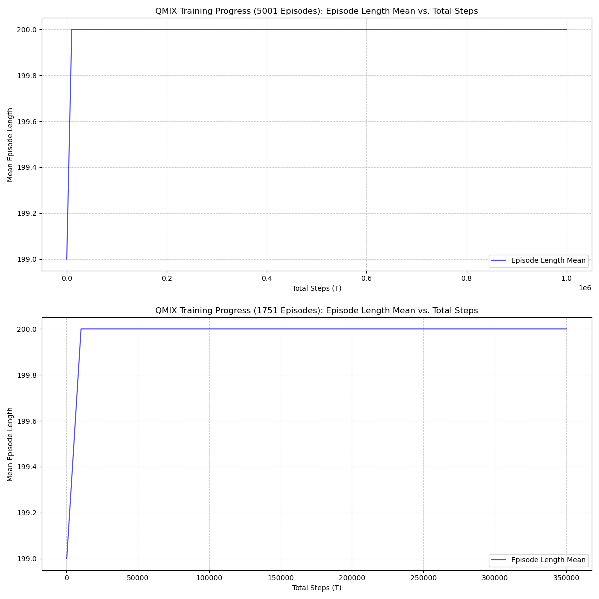
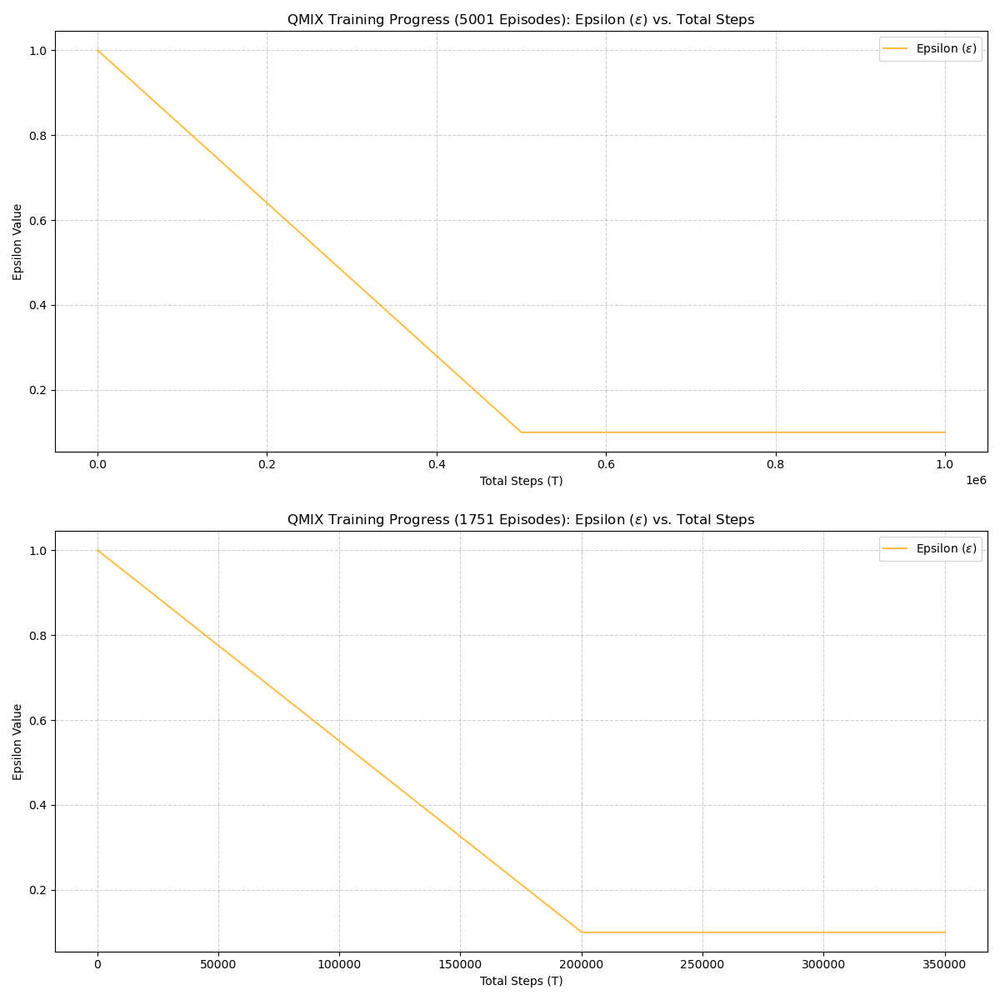
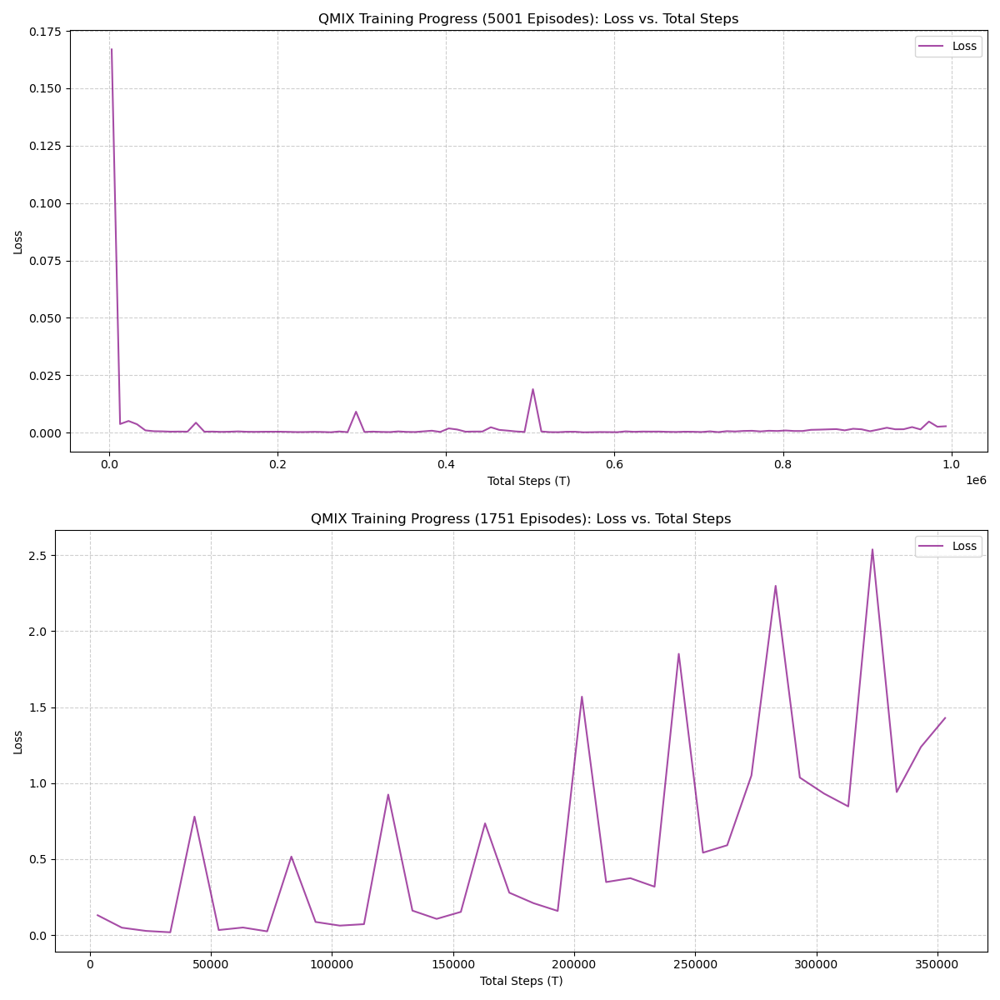
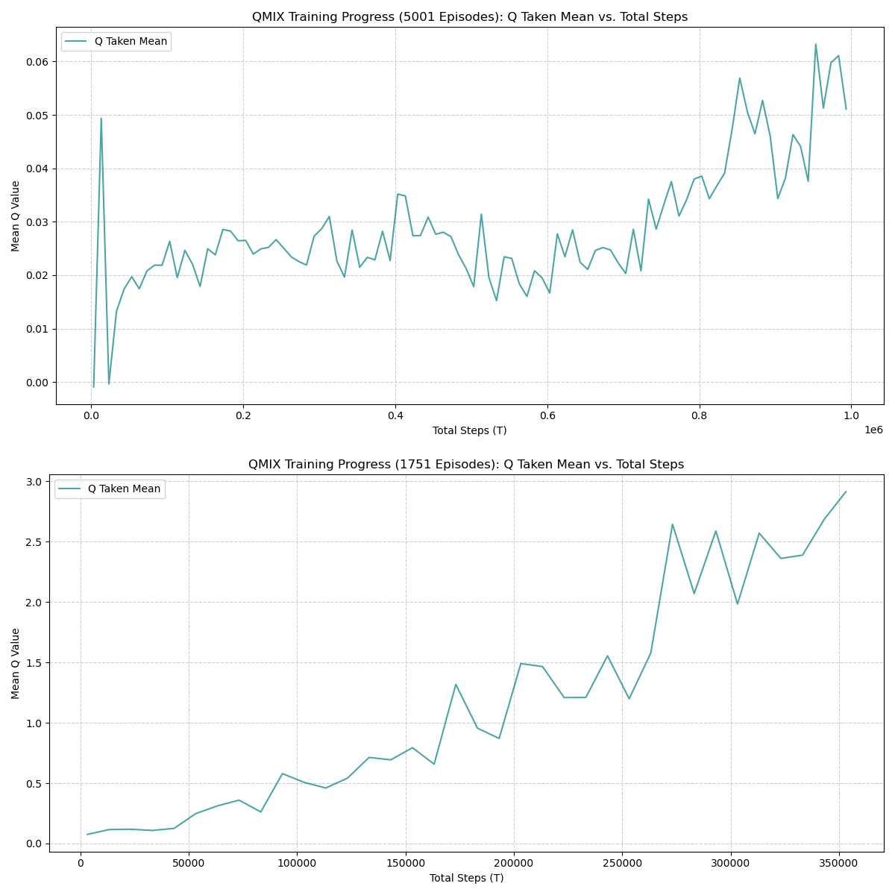
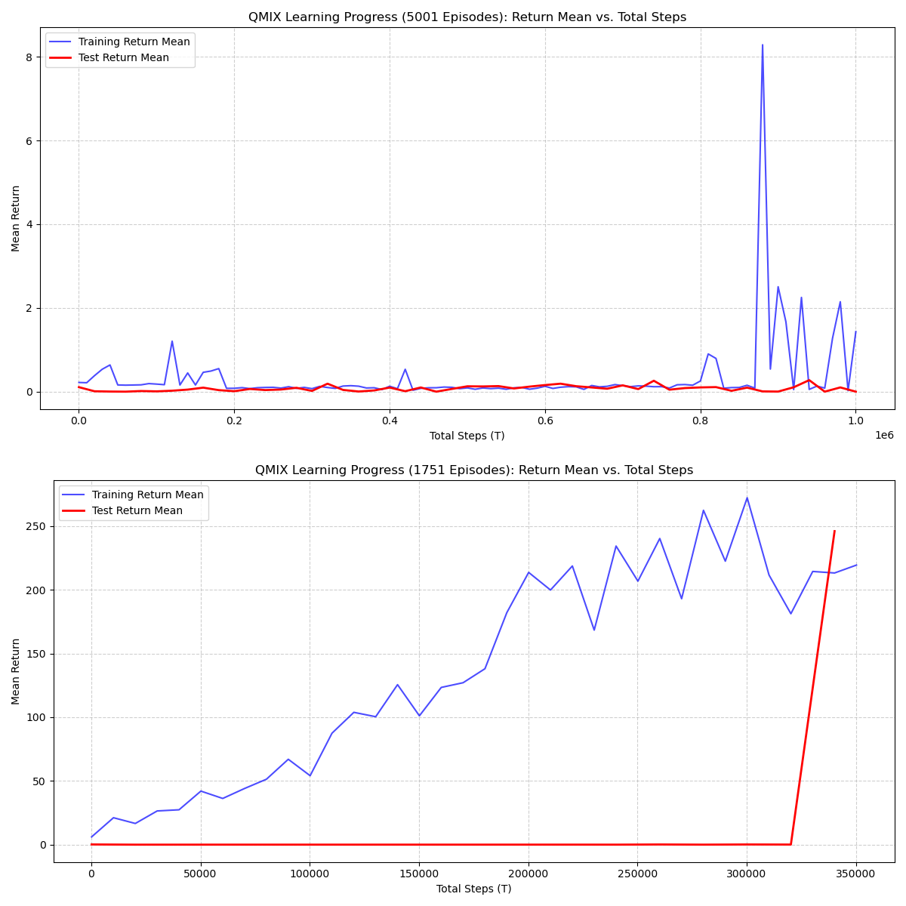
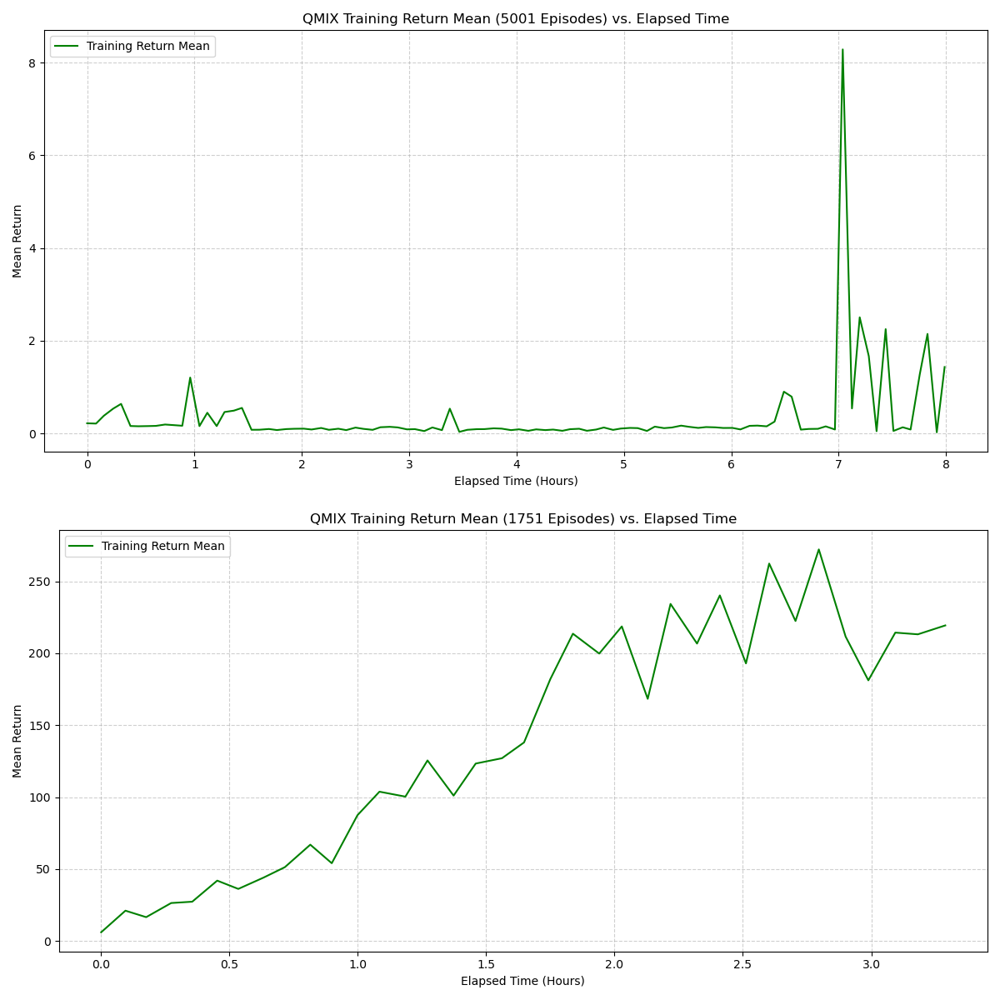
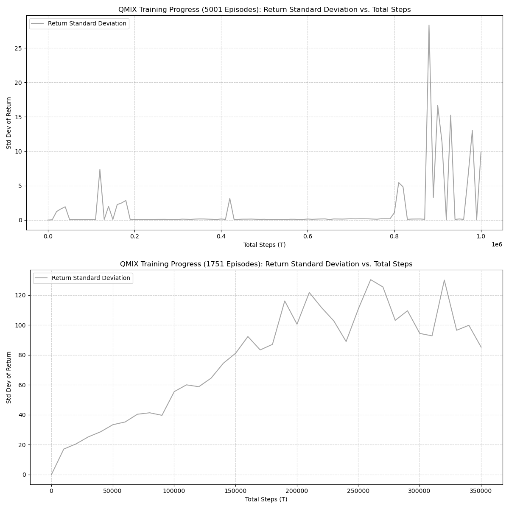
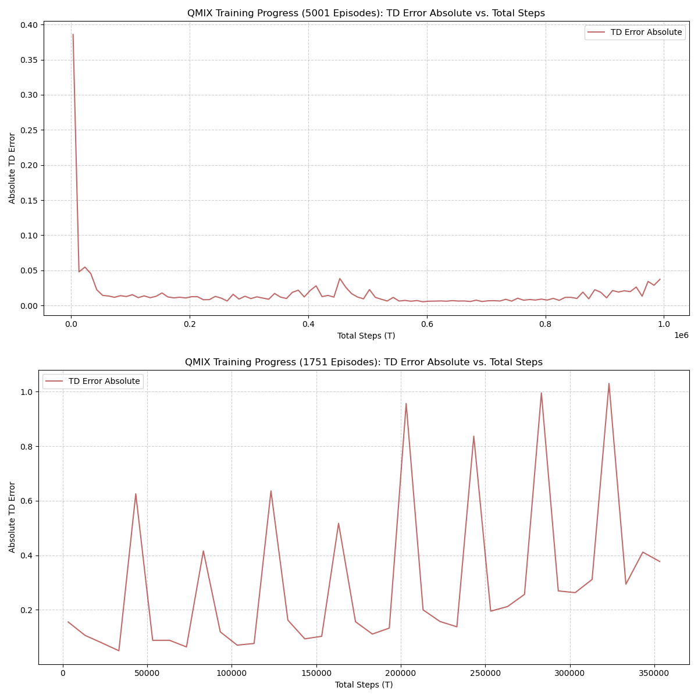

This report presents the performance evaluation of the QMIX multi-agent reinforcement learning model trained on 
the Unity-based warehouse environment. The objective of this analysis is to assess the learning stability, 
convergence behavior, and overall policy quality through two core metrics:

- **Training Return Mean (`return_mean`)**  
- **Evaluation Return Mean (`test_return_mean`)**

Both metrics were extracted from the Sacred experiment logs and visualized for clarity.

# QMIX Training & Test Return

## Initial 

| Parameter               | Value                     | Purpose / Why Important                                                                 |
|-------------------------|---------------------------|-------------------------------------------------------------------------------------------|
| batch_size              | 16                        | Number of samples per learner update; small batch → faster but noisier learning.         |
| buffer_size             | 2000                      | Replay buffer capacity storing past experiences.                                          |
| epsilon_start           | 1.0                       | Initial exploration rate (full exploration).                                              |
| epsilon_finish          | 0.1                       | Minimum exploration value when training stabilizes.                                       |
| epsilon_anneal_time     | 500000                    | Timesteps over which epsilon decays from 1.0 → 0.1.                                       |
| episode_limit           | 500                       | Maximum steps per episode.                                                                |
| env_args.no_graphics    | false                     | Runs Unity with graphics enabled.                                                         |
| env_args.time_scale     | 20.0                      | Unity simulation runs 20× faster than real time.                                          |
| t_max                   | 1000000                   | Total number of training timesteps.                                                       |
| gamma                   | 0.99                      | Standard discount factor prioritizing long-term rewards.                                  |
| lr (learning rate)      | 0.0005                    | Learning rate for optimizer controlling update speed.                                     |
| mixer                   | qmix                      | QMIX mixing network for cooperative value decomposition.                                  |
| agent                   | rnn                       | Recurrent agent network to handle partial observability.                                  |
| save_model              | true                      | Model checkpoints are saved during training.                                              |
     
## Optimized 

| Parameter               | Value                     | Purpose / Why Important                                                                 |
|-------------------------|---------------------------|-------------------------------------------------------------------------------------------|
| batch_size              | 16                        | Number of samples per learner update; small batch → faster but noisier learning.         |
| buffer_size             | 5000                      | Replay buffer capacity storing past experiences.                                          |
| epsilon_start           | 1.0                       | Initial exploration rate (full exploration).                                              |
| epsilon_finish          | 0.1                       | Minimum exploration value when training stabilizes.                                       |
| epsilon_anneal_time     | 200000                    | Timesteps over which epsilon decays from 1.0 → 0.1.                                       |
| episode_limit           | 300                       | Maximum steps per episode.                                                                |
| env_args.no_graphics    | true                      | Runs Unity headless → faster performance.                                                 |
| env_args.time_scale     | 50.0                      | Unity simulation runs 50× faster than real time.                                          |
| t_max                   | 500000                    | Total number of training timesteps.                                                       |
| gamma                   | 0.99                      | Standard discount factor prioritizing long-term rewards.                                  |
| lr (learning rate)      | 0.001                     | Learning rate for optimizer controlling update speed.                                     |
| mixer                   | qmix                      | QMIX mixing network for cooperative value decomposition.                                  |
| agent                   | rnn                       | Recurrent agent network to handle partial observability.                                  |
| save_model              | true                      | Model checkpoints are saved during training.                                              |

## What changed

| Parameter               | Old Value   | New Value   | Meaning of Change                                                                 |
|-------------------------|-------------|-------------|------------------------------------------------------------------------------------|
| buffer_size             | 2000        | 5000        | Larger replay buffer → more diverse samples, more stable learning.                 |
| epsilon_anneal_time     | 500000      | 200000      | Exploration decays faster → becomes greedy earlier.                                |
| episode_limit           | 500         | 300         | Shorter episodes → agents must complete tasks faster.                              |
| env_args.no_graphics    | false       | true        | Now headless mode → significantly faster Unity simulation.                         |
| env_args.time_scale     | 20.0        | 50.0        | Simulation now 2.5× faster.                                                        |
| t_max                   | 1000000     | 500000      | Training time cut in half.                                                         |
| lr (learning rate)      | 0.0005      | 0.001       | Higher learning rate → faster but potentially less stable.                         |

The plot below compares the learning curve during training with periodic evaluation episodes.  
The training return increases steadily and stabilizes with occasional variance, while evaluation returns appear 
toward the final stage, showing a large improvement spike. It also show the previous week metrics and how
it compares to this week with changes parameters and increase trainning. 

# Summary

The QMIX agent demonstrates strong learning progression throughout training, with the following notable observations:

- **Stable upward trend** in `return_mean`, confirming effective joint action-value decomposition under QMIX.  
- **Late-stage surge** in `test_return_mean`, indicating the final policy generalizes well when evaluated outside the training loop.
- **Variance near convergence** suggests exploration and state-space complexity influence final policy stability.

Overall, the QMIX model exhibits reliable multi-agent coordination behavior suitable for the warehouse robot control scenario.

---

### References

* OpenAI. (2024). ChatGPT (Oct 23 version) [Large language model]. https://chat.openai.com/chat
