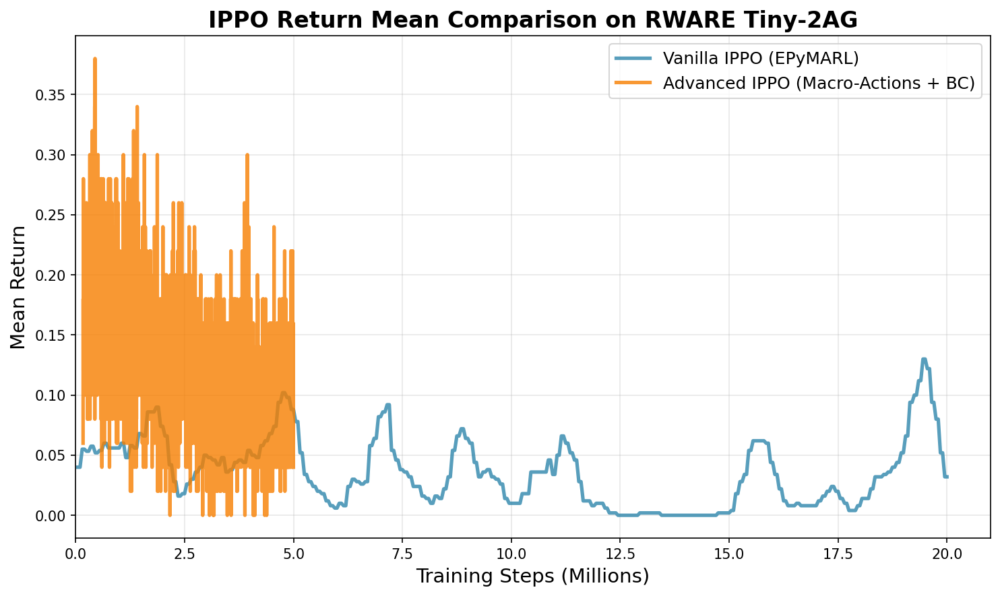

## Overview

Trained and compared two IPPO implementations on `rware-tiny-2ag-v2` (2 robots, 8x8 grid, 4 packages):

- **Vanilla IPPO**: EPyMARL baseline with exploration tuning
- **Advanced IPPO**: Custom implementation with macro-actions and behavioral cloning

## Methods

### Vanilla IPPO (EPyMARL)
Standard Independent PPO with increased entropy for exploration.

**Key Hyperparameters:**

- `entropy_coef`: 0.1 (3x higher than default)
- `lr`: 0.0001
- `buffer_size`: 1024
- `batch_size`: 256
- `hidden_dim`: 96
- `epochs`: 4
- `gae_lambda`: 0.95
- Training steps: 20M

### Advanced IPPO (Custom)
Enhanced IPPO with macro-actions and warm-start.

**Key Features:**

- **Macro-actions**: Agent commits to each action for 4 steps, making it easier to learn which actions led to success
- **Behavioral cloning**: Pre-train agents by copying simple rule-based strategies to give them a head start
- **EMA actors**: Use smoothed version of learned policy for more stable testing performance
- **Entropy floor**: Keep agents exploring new behaviors throughout training to avoid getting stuck
- **Dynamic clip decay**: Gradually reduce how much the policy can change per update as learning progresses

**Key Hyperparameters:**

- `lr`: 0.0003
- `batch_size`: 256
- `hidden_dim`: 128
- `epochs`: 10
- `entropy_coef`: 0.01
- Training steps: 5M

## Results

### Return Mean Comparison

**Vanilla IPPO (20M steps):**

- Final: 0.032
- Peak: 0.130

**Advanced IPPO (5M steps):**

- Final: 0.040
- Peak: 0.380

## Key Findings

1. **Exploration matters**: Vanilla IPPO required 3x higher entropy (0.1 vs 0.03) to prevent premature convergence
2. **Advanced features help**: Macro-actions and BC warm-start achieved 3x better peak return (0.38 vs 0.13)
3. **Sample efficiency**: Advanced IPPO reached peak performance in 4x fewer steps (5M vs 20M)
4. **Stability issues**: Both approaches showed performance degradation over extended training

## Conclusion

Advanced IPPO with macro-actions and BC warm-start significantly outperformed vanilla IPPO in both sample efficiency and peak performance. The advanced implementation achieved:

- **3x better peak return** (0.38 vs 0.13)
- **4x better sample efficiency** (peak at 5M vs 20M steps)

However, both implementations face stability challenges requiring further investigation into:

- Reward shaping
- Curriculum learning
- Value function clipping
- Exploration scheduling
