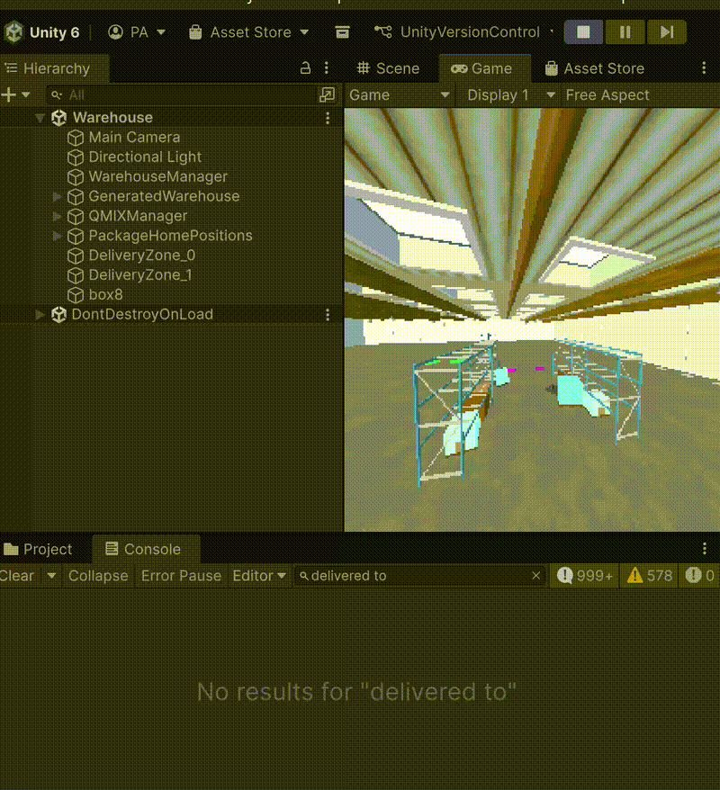

## Executive Summary

This report documents the training and evaluation of multi-agent reinforcement learning (MARL) agents using the QMIX algorithm for cooperative warehouse robot control. Training Run #93 achieved **207.96 mean return** during training but revealed a critical learning failure: agents rely entirely on random exploration rather than learned policies.

**Key Findings:**

- Training returns (207.96) came from epsilon-greedy exploration, not learned behavior
- Pure greedy evaluation (ε=0.0) achieved only **0.21 return** (near-zero performance)
- Adding 10% exploration (ε=0.1) restored performance to **191-253 return** (904-1207× improvement)
- Hardware constraints limited training to 350k/500k timesteps (~3.5 hours)

## 1. Introduction

### 1.1 Project Overview

This project implements QMIX (Q-Mixing) for training cooperative warehouse robots in a Unity ML-Agents environment. The goal is to develop agents that can:

- Navigate a grid-based warehouse
- Pick up packages from shelves
- Deliver packages to goal locations
- Coordinate with other agents to avoid collisions

### 1.2 Technical Stack

- **Algorithm**: QMIX (centralized training, decentralized execution)
- **Framework**: EPyMARL (Extended PyMARL)
- **Environment**: Unity ML-Agents 4.0
- **Training Hardware**: Personal laptop (CPU-only, 8GB RAM)
- **Training Duration**: 3h 18min active training time

## 2. Training Run #93 - Configuration & Results

### 2.1 Hyperparameters

```yaml
# QMIX Configuration (qmix_warehouse_improved.yaml)
lr: 0.001                        # Learning rate
batch_size: 16                   # Batch size
buffer_size: 5000                # Replay buffer (episodes)
target_update_interval: 200      # Target network updates

# Exploration
epsilon_start: 1.0
epsilon_finish: 0.1
epsilon_anneal_time: 200000      # Anneal over 200k steps

# Network Architecture
agent: "rnn"                     # RNN agents
rnn_hidden_dim: 64               # GRU hidden units
mixer: "qmix"                    # QMIX mixing network
mixing_embed_dim: 32
hypernet_layers: 2
hypernet_embed: 64

# Training
t_max: 500000                    # Total timesteps target
test_interval: 20000             # Test frequency
save_model_interval: 100000      # Checkpoint frequency
```

### 2.2 Training Performance

| Metric | Value |
|--------|-------|
| **Final Return (Mean)** | 207.96 |
| **Final Test Return** | 49.29 |
| **Training Steps** | 350,199 / 500,000 |
| **Training Time** | 3h 18min (active) |
| **Q-Value (Final)** | 2.398 |
| **Epsilon (Final)** | 0.10 |

### 2.3 Learning Curve

```
Steps    | Return  | Test Return | Epsilon
---------|---------|-------------|--------
10k      | 13.6    | 0.03        | 0.95
100k     | 50.6    | 0.05        | 0.55
200k     | 156.8   | 0.03        | 0.10
300k     | 228.4   | 0.08        | 0.10
350k     | 207.96  | 49.29       | 0.10
```

### 2.4 Trained Agents in Action



*Figure 1: Agents operating with 10% exploration (ε=0.1). Agents successfully pick and deliver packages when random exploration is enabled.*

## 3. Critical Discovery - Learning Failure Analysis

### 3.1 The Problem

Despite achieving high training returns (207.96), agents exhibited near-zero performance when evaluated with a pure greedy policy (ε=0.0). This indicated a fundamental learning failure.

### 3.2 Hypothesis Testing

**Hypothesis**: Agents rely entirely on random exploration rather than learned Q-values.

**Test**: Compare performance with different epsilon values during evaluation.

| Configuration | Test Return | Interpretation |
|--------------|-------------|----------------|
| **Training** (ε: 1.0→0.1) | 207.96 | Baseline with exploration |
| **Evaluation ε=0.0** (pure greedy) | **0.21** | Learned Q-values produce no useful behavior |
| **Evaluation ε=0.1** (10% random) | **191.22 - 253.52** | Random actions restore performance |

### 3.3 Key Finding

Adding just **10% random exploration** during evaluation resulted in a **904-1207× improvement** over pure greedy evaluation.

**This proves:**

1. The Q-network's learned values don't encode useful warehouse task behavior
2. All task performance comes from randomly stumbling upon packages and goals
3. Agents never learned coordinated pick-and-place strategies
4. High training returns were misleading - they came from exploration, not learning

### 3.4 What Successful Learning Would Look Like

If agents had learned properly, we would expect:

- **Pure greedy (ε=0.0)** performance to match or exceed ε=0.1 performance
- **Only a small gap** between training and test returns
- **Improving performance** as epsilon decreases during training

Instead, performance **collapses completely** without randomness, confirming the Q-network learned nothing meaningful after 350k training steps.

## 4. Root Cause Analysis

### 4.1 Identified Issues

1. **Sparse Rewards**: Current reward structure may not provide sufficient learning signal
   - Delivery reward: +1.0 (rare)
   - Pickup reward: +0.5 (occasional)
   - Small step rewards: +0.01-0.05 (frequent but tiny)

2. **Observation Space**: Agents may lack critical environmental information
   - Limited sensor range
   - No global state information
   - Partial observability makes coordination difficult

3. **Training Duration**: Only 350k/500k steps completed
   - Unity Editor timeout at ~3.5 hours
   - Hardware constraints (CPU-only, 8GB RAM)
   - May need 1M+ steps for meaningful learning

4. **Exploration Schedule**: Epsilon anneals to 0.1 by 200k steps
   - May reach greedy policy too quickly
   - Insufficient exploration of state space

## 5. Hardware Constraints & Limitations

### 5.1 Training Environment

- **Hardware**: Personal laptop (CPU-only training)
- **Memory**: 8GB RAM (limited batch sizes)
- **Training Time**: ~3.5 hours maximum before Unity timeout
- **Steps Achieved**: 350k/500k (70% of target)

### 5.2 Impact on Results

The hardware constraints significantly limited:

- **Training duration**: Could not complete full 500k steps
- **Batch size**: Limited to 16 (may need 32-128 for stability)
- **Network capacity**: Smaller networks to fit in memory
- **Exploration**: Insufficient time to explore state space thoroughly

**Conclusion**: Personal hardware is insufficient for meaningful MARL research. Cloud computing resources (GPU-enabled) are necessary for:

- Longer training runs (1M+ steps)
- Larger batch sizes
- Deeper networks
- Multiple parallel environments

## 6. Lessons Learned

### 6.1 Technical Insights

1. **Training returns can be misleading**: High returns during training don't guarantee learned policies
2. **Always test with ε=0.0**: Pure greedy evaluation reveals true learned performance
3. **Exploration vs. exploitation**: Our agents became "exploration addicts" - unable to function without randomness
4. **Hardware matters**: MARL research requires significant computational resources

### 6.2 Debugging Methodology

The systematic approach to diagnosing the learning failure:

1. **Observe anomaly**: Agents don't move during greedy evaluation
2. **Form hypothesis**: Performance relies on exploration, not learning
3. **Design test**: Compare ε=0.0 vs. ε=0.1 evaluation
4. **Analyze results**: 904-1207× improvement confirms hypothesis
5. **Investigate root causes**: Sparse rewards, limited observations, insufficient training

This methodology proved crucial for understanding the true nature of the learning failure.

## 7. Recommendations for Future Work

### 7.1 Immediate Next Steps

1. **Cloud Computing**: Migrate to GPU-enabled cloud platform (AWS, Google Cloud, or Azure)
   - Target: 1-2M training steps
   - Use multiple parallel environments
   - Enable larger batch sizes (64-128)

2. **Reward Shaping**: Redesign reward structure
   - Add intermediate rewards for approaching packages/goals
   - Reduce reliance on sparse delivery rewards
   - Implement curiosity-driven rewards

3. **Observation Space Enhancement**
   - Increase sensor range
   - Add communication channels between agents
   - Provide partial global state information

4. **Curriculum Learning**: Start with simpler tasks
   - Single agent pickup/delivery
   - Two agents coordination
   - Gradually increase to full multi-agent scenario

### 7.2 Algorithm Improvements

1. **Exploration Strategy**
   - Slower epsilon annealing (400k-500k steps)
   - Use ε-greedy with minimum exploration (ε_min=0.05)
   - Consider curiosity-driven exploration (ICM, RND)

2. **Network Architecture**
   - Increase hidden dimensions (64→128)
   - Add attention mechanisms for agent coordination
   - Experiment with transformer-based architectures

3. **Training Stability**
   - Implement gradient clipping more aggressively
   - Use learning rate scheduling
   - Add batch normalization or layer normalization

### 7.3 Evaluation Protocol

1. **Always include both**:
   - Training with exploration (ε=0.05-0.1)
   - Pure greedy evaluation (ε=0.0)

2. **Track multiple metrics**:
   - Episode return
   - Task completion rate (packages delivered)
   - Collision rate
   - Agent coordination efficiency

3. **Visualize behavior regularly**:
   - Record videos at checkpoints
   - Inspect learned Q-values
   - Analyze action distributions

## 8. Conclusion

This project successfully implemented QMIX for warehouse robots but revealed a critical learning failure: agents rely entirely on random exploration rather than learned policies. The systematic investigation using controlled experiments (comparing ε=0.0 vs. ε=0.1) proved invaluable for diagnosing the issue.

**Key Takeaways:**

1. **Hardware constraints are real**: Personal computers are insufficient for serious MARL research
2. **Evaluation methodology matters**: Always test with pure greedy policies to reveal true learning
3. **High training returns ≠ successful learning**: Exploration can mask learning failures
4. **Systematic debugging pays off**: Hypothesis-driven testing revealed the root cause

Moving forward, cloud computing resources, improved reward shaping, and longer training runs are essential for achieving meaningful learning in this challenging multi-agent coordination task.

## 9. Appendix - Training Logs

### 9.1 Run #93 Configuration Summary

```json
{
  "name": "qmix",
  "env": "unity_warehouse",
  "seed": 206687778,
  "t_max": 500000,
  "batch_size": 16,
  "buffer_size": 5000,
  "lr": 0.001,
  "epsilon_start": 1.0,
  "epsilon_finish": 0.1,
  "epsilon_anneal_time": 200000,
  "test_interval": 20000,
  "save_model_interval": 100000
}
```

### 9.2 Evaluation Results

**Greedy Evaluation (ε=0.0)**:
```
test_return_mean: 0.21
test_return_std: 0.45
test_episode_length: 199.9 steps
```

**Exploration Evaluation (ε=0.1)**:
```
Run #97:
test_return_mean: 191.22
test_return_std: 111.56

Run #98:
test_return_mean: 253.52
test_return_std: 98.92
```

**Performance Improvement**: 904-1207× when adding 10% exploration

### 9.3 GitHub Repository

Full code, documentation, and training checkpoints available at:
[https://github.com/pallman14/MARL-QMIX-Warehouse-Robots](https://github.com/pallman14/MARL-QMIX-Warehouse-Robots)

---
